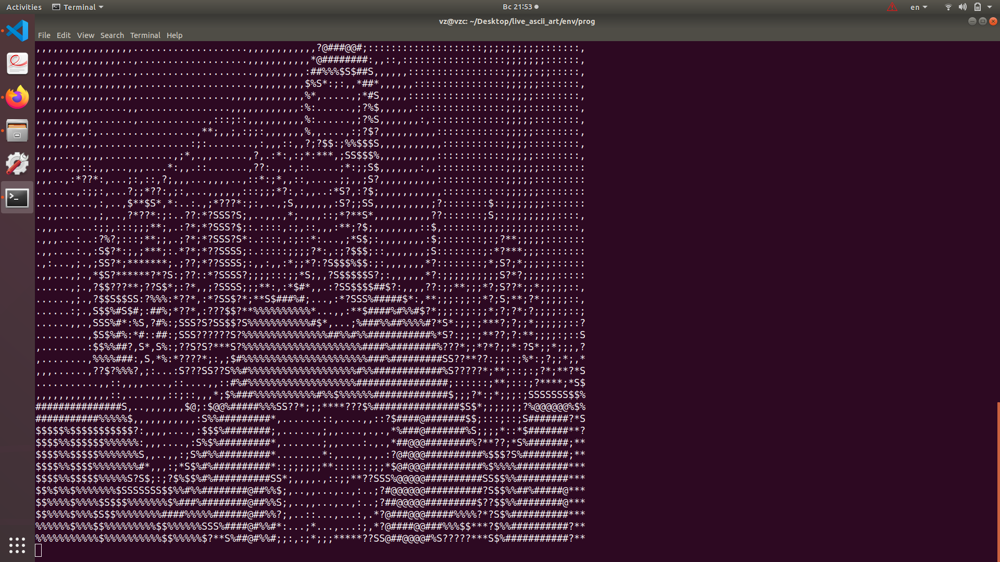
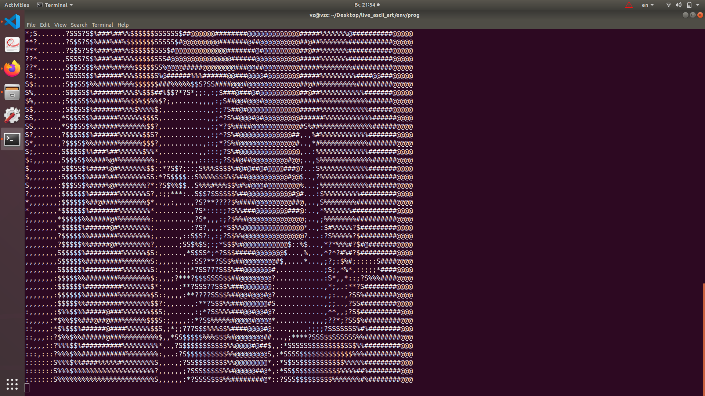

<h1>VASCII - REALTIME VIDEO ASCII CONVERTER</h1>

This is a console application to convert live video to ascii video.

Start this app and select the pixel size, the recommended size is 8 to 12.

<h2>Examples</h2>

